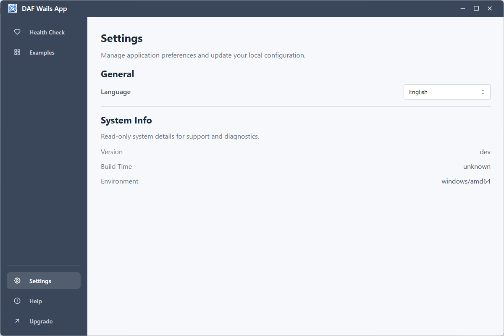

# daf-wails-template

Language: [English](README.md) | [中文](README.zh-CN.md)

> A production-ready Wails desktop application starter template.\
> Built with Go 1.23 and Wails v2.11.0

Build modern desktop applications with Wails --- without rebuilding
infrastructure every time.


------------------------------------------------------------------------

## 🚀 Why daf-wails-template?

The official Wails template is great for getting started.\
But real-world desktop apps repeatedly require:

-   Structured logging
-   Build-time version injection
-   System metadata management
-   User configuration persistence
-   Internationalization (i18n)
-   Clear backend/frontend separation
-   Minimal production-ready UI
-   Custom titlebar support

This template standardizes those capabilities into a reusable
architecture.

Focus on building your product --- not rebuilding foundations.

------------------------------------------------------------------------
## 🖼 Preview



## ✨ Features

### 🧱 Core Infrastructure (Go Backend)

-   Structured logger
-   System metadata via `ldflags`
-   Build-time version & build time injection
-   User configuration management
-   Environment-aware configuration
-   Modular backend structure
-   Cross-platform support (Windows / macOS / Linux)

### 🎨 Frontend (React + Mantine)

-   React 18
-   Mantine 7
-   AppShell layout
-   Sidebar navigation
-   Health Check page
-   About / System Info page
-   Light / Dark theme support
-   i18n (English / Chinese)
-   Clean minimal UI inspired by modern desktop tools

------------------------------------------------------------------------

## 🛠 Tech Stack

Backend: - Go 1.23 - Wails v2.11.0

Frontend: - React 18 - Mantine 7 - React Router - i18next - Vite

Package Manager: - pnpm (recommended)

------------------------------------------------------------------------

## 📂 Project Structure

Top-level layout (one-level overview) and purpose of each folder/file:

- `backend/` : Go backend application and Wails bindings (app entrypoints, bridge code, adapters).
- `core/` : Core modules such as configuration management, defaults and shared utilities.
- `config/` : Repository-level configuration files and templates.
- `build/` : Build artifacts, packaging scripts and CI helpers.
- `cmd/` : CLI entrypoints or helper commands.
- `frontend/` : React + Vite frontend source code, components, pages and assets.
- `wails.json` and `main.go` : Wails configuration and Go application entry for embedding frontend assets.
- `wailsjs/` : Generated Wails JS runtime bindings used by the frontend.
- `openspec/` : Design proposals, specs and change-tracking used by the project.
- `docs/` : Documentation and developer guides.
- `scripts/` : Utility scripts for building or packaging (e.g. macOS / Windows build scripts).
- `logger/`, `systeminfo/`, `sysconfig/`, `updater/`, `plugin/`, `diagnostics/` : Modular backend features and services.
- `package.json`, `pnpm-lock.yaml` : Frontend package manifest and lockfile.

This section lists the primary top-level folders and files you will most likely interact with; deeper implementation files are organized under these folders.

------------------------------------------------------------------------

## ⚡ Getting Started

### 1️⃣ Install Wails CLI

``` bash
go install github.com/wailsapp/wails/v2/cmd/wails@latest
```

### 2️⃣ Install dependencies

``` bash
pnpm install
```

### 3️⃣ Run in development mode

``` bash
wails dev
```

### 4️⃣ Build production binary

``` bash
wails build
```

------------------------------------------------------------------------

## 🧬 Inject Build Metadata

Inject version and build time during build:

``` bash
wails build -ldflags "
-X main.Version=1.0.0
-X main.BuildTime=$(date -u '+%Y-%m-%dT%H:%M:%SZ')
"
```

If variables are defined in another package, use full path:

``` bash
-X github.com/your/module/backend/system.Version=1.0.0
```

------------------------------------------------------------------------

## 🖥 Default UI Pages

-   **Health Check** -- operational landing page
-   **Settings** -- version, build time, environment
-   Sidebar layout with clean desktop-style navigation

Designed for SaaS companion apps, internal tools, and system utilities.

------------------------------------------------------------------------

## 🎯 Use Cases

-   SaaS desktop companion
-   Enterprise internal tools
-   Monitoring clients
-   System utilities
-   Admin dashboards
-   Infrastructure control panels

------------------------------------------------------------------------

## 📈 Roadmap

-   [ ] Auto update module
-   [ ] Plugin system
-   [ ] License validation
-   [ ] Telemetry module
-   [ ] Theme customization engine
-   [ ] CLI scaffolding generator

------------------------------------------------------------------------

## 🤝 Contributing

Contributions are welcome.

If you build something useful on top of this template, feel free to open
a PR or share your project.

------------------------------------------------------------------------

## 📜 License

MIT License

You are free to use this template in commercial and private projects.

------------------------------------------------------------------------

## ⭐ Support the Project

If this template saves you time, please consider giving it a Star.

It helps the project grow and reach more developers.
